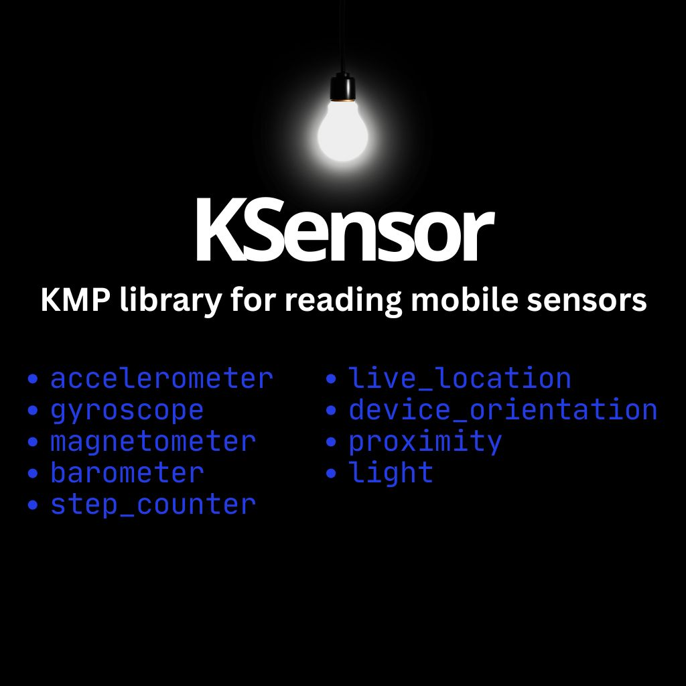

[](https://kotlinlang.org/)
[](https://gradle.org/)
[](https://opensource.org/licenses/Apache-2.0)



<!-- GETTING STARTED -->
## Getting Started
### Adding dependencies
Add it in your `commonMain.dependencies` :

  ```
  implementation("io.github.shadmanadman:KSensor:1.2.22")
  ```

### Sensors Observation
- Create a list of sensors that you need:

```
val sensors = listof(
SensorType.ACCELEROMETER,
SensorType.GYROSCOPE,
SensorType.MAGNETOMETER,
SensorType.BAROMETER,
SensorType.STEP_COUNTER,
SensorType.LOCATION,
SensorType.DEVICE_ORIENTATION,
SensorType.PROXIMITY,
SensorType.LIGHT)
```
- Register sensors for observation:

```
KSensor.registerSensors(
    types = sensors,
    locationIntervalMillis = 1000L // Optional
).collect { sensorUpdate ->
    when (sensorUpdate) {
        is SensorUpdate.Data -> // Get sensor data here
        is SensorUpdate.Error -> // Get errors here
    }
}
```
- Unregister sensors when no longer needed:

```
KSensor.unregisterSensors(sensors)
```

Each `SensorData` has a `platformType` so you know the sensor data comes from Android or iOS.


### States Observation
- Just like sensors, create a list of states that you need to observe:

```
val states = listOf(StateType.APP_VISIBILITY,StateType.SCREEN_STATE)
```
- Add observers

```
KState.addObserver(types = states).collect{ stateUpdate->
   when(stateUpdate){
	is StateUpdate.Data-> // Get state data here
	is StateUpdate.Error-> // Get errors here
   }
}
```
- Remove observer when no longer needed

```
KState.removeObserver(states)
```

Each `StateData` has a `platformType` so you know the state data comes from Android or iOS.


#### Permissions
- If you are using Location you need `FINE_LOCATION` and `COARSE_LOCATION` permissions on Android. You can handel this permissions yourself or let the library handle them for you:
```
    //Put this in AndroidManifest
    <uses-permission android:name="android.permission.ACCESS_COARSE_LOCATION"/>
    <uses-permission android:name="android.permission.ACCESS_FINE_LOCATION"/>
```
- Inside a composable call:
```
KSensor.HandelPermissions() { status ->
    when (status) {
        PermissionStatus.Granted -> println("Permission Granted")
        PermissionStatus.Denied -> println("Permission Denied")
    }
}
```
Note that the iOS location permission is handled by the library itself.


