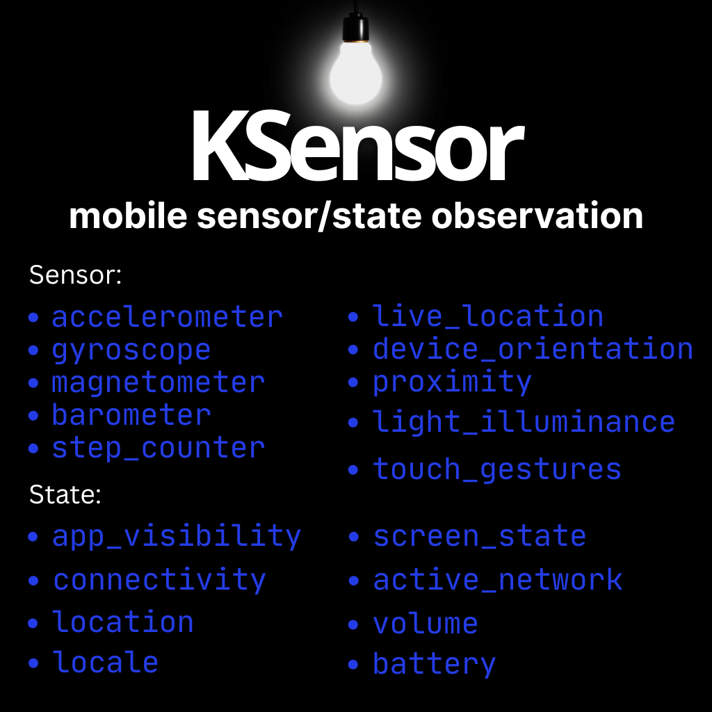

[](https://kotlinlang.org/)
[](https://gradle.org/)
[](https://opensource.org/licenses/0BSD)



## Getting Started
### Adding dependencies

Add it in your `commonMain.dependencies` :

  ```
  implementation("io.github.shadmanadman:KSensor:1.90.40")
  ```

### Sensors Observation

- Create a list of sensors you need to observe.

``` kotlin
val sensors = listof(
SensorType.ACCELEROMETER,
SensorType.GYROSCOPE,
SensorType.MAGNETOMETER,
SensorType.BAROMETER,
SensorType.STEP_COUNTER,
SensorType.LOCATION,
SensorType.DEVICE_ORIENTATION,
SensorType.PROXIMITY,
SensorType.LIGHT,
SensorType.TOUCH_GESTURES)
```

- Register sensors for observation.

``` kotlin
KSensor.registerSensors(
    types = sensors,
    locationIntervalMillis = 1000L // Optional
).collect { sensorUpdate ->
    when (sensorUpdate) {
        is SensorUpdate.Data -> // println(it.data, it.platformType)
        is SensorUpdate.Error -> // Get errors here
    }
}
```

- Unregister sensors when no longer needed.

``` kotlin
KSensor.unregisterSensors(sensors)
```

Each `SensorUpdate` has a `platformType` so you know the sensor data comes from Android or iOS.

- Sensor Data Models, represents the `sensorUpdate.data`:
``` kotlin
Accelerometer(val x: Float, val y: Float,val z: Float)
Gyroscope(val x: Float, val y: Float, val z: Float)
Magnetometer(val x: Float, val y: Float, val z: Float)
Barometer(val pressure: Float)
StepCounter(val steps: Int)
Location(val lat: Double? = null, val lon: Double? = null, val alt: Double? = null)
Orientation(val orientation: DeviceOrientation,val orientationInt: Int = 0)
Proximity(val distanceInCM: Float, val isNear: Boolean)
LightIlluminance(val illuminance: Float)
TouchGestures(val x: Float,val y: Float,val type: TouchGestureType)
```

### States Observation

- Just like sensors, create a list of states that you need to observe.

``` kotlin
val states = listOf(
StateType.APP_VISIBILITY,
StateType.CONNECTIVITY,
StateType.ACTIVE_NETWORK,
StateType.LOCATION,
StateType.SCREEN_STATE
)
```

- Add observers.

``` kotlin
KState.addObserver(types = states).collect{ stateUpdate->
   when(stateUpdate){
	is StateUpdate.Data-> // println(it.data, it.platformType)
	is StateUpdate.Error-> // Get errors here
   }
}
```

- Remove observer when no longer needed.

``` kotlin
KState.removeObserver(states)
```

Each `StateUpdate` has a `platformType` so you know the state data comes from Android or iOS.

- State Data Models, represent the `StateUpdate.data`:
``` kotlin
AppVisibilityStatus(val isAppVisible: Boolean)
LocationStatus(val isLocationOn: Boolean)
ScreenStatus(val isScreenOn: Boolean)
CurrentActiveNetwork(val activeNetwork: ActiveNetwork)
ConnectivityStatus(val isConnected: Boolean)
```


#### Permissions

If you are observing location you need `FINE_LOCATION` and `COARSE_LOCATION` permissions on Android.
You can handel this permissions yourself or let the library handle them for you:
``` kotlin
    //Put this in AndroidManifest
    <uses-permission android:name="android.permission.ACCESS_COARSE_LOCATION"/>
    <uses-permission android:name="android.permission.ACCESS_FINE_LOCATION"/>
```

- Inside a composable call:

``` kotlin
KSensor.HandelPermissions() { status ->
    when (status) {
        PermissionStatus.Granted -> println("Permission Granted")
        PermissionStatus.Denied -> println("Permission Denied")
    }
}
```
Note that the iOS location permission is handled by the library itself.


```
Copyright (c) 2025 KSensor

Permission to use, copy, modify, and/or distribute this software for any purpose
with or without fee is hereby granted.

THE SOFTWARE IS PROVIDED "AS IS" AND THE AUTHOR DISCLAIMS ALL WARRANTIES
WITH REGARD TO THIS SOFTWARE INCLUDING ALL IMPLIED WARRANTIES OF
MERCHANTABILITY AND FITNESS. IN NO EVENT SHALL THE AUTHOR BE LIABLE FOR
ANY SPECIAL, DIRECT, INDIRECT, OR CONSEQUENTIAL DAMAGES OR ANY DAMAGES
WHATSOEVER RESULTING FROM LOSS OF USE, DATA OR PROFITS, WHETHER IN AN
ACTION OF CONTRACT, NEGLIGENCE OR OTHER TORTIOUS ACTION, ARISING OUT OF
OR IN CONNECTION WITH THE USE OR PERFORMANCE OF THIS SOFTWARE.
```


