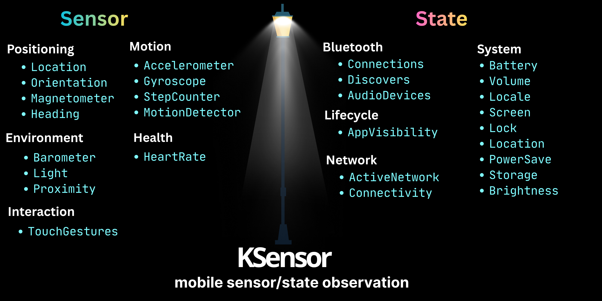

[](https://kotlinlang.org/)
[](https://gradle.org/)
[](https://opensource.org/licenses/0BSD)

<p align="center">
  
</p>

# KSensor

KSensor is a Kotlin Multiplatform library for observing device sensors and system states. Each sensor or state is grouped into its own plugin, allowing you to include only the features you need. This prevents pulling in unnecessary code and permissions.

All data emitted by plugins is wrapped in a `KSensorResponse<T>` which includes:
- `data`: The actual sensor or state data.
- `platform`: The platform type (Android or iOS).
- `timestamp`: The system time when the data was collected.

## Permissions Handling

Some plugins require system permissions to function. Each plugin exposes a `requiredPermissions` list indicating what it needs. KSensor provides a `PermissionHandler` interface in the Core module to help check and request these permissions across platforms.

### Core Module API
```kotlin
object KSensor {
    /**
     * Flag to enable/disable "start on boot" for the entire library.
     */
    var startOnBoot: Boolean

    /**
     * Registers a plugin.
     * @param startOnBoot If true, this plugin will be marked to start automatically on device boot.
     */
    fun register(plugin: KSensorPlugin, startOnBoot: Boolean = false)

    /**
     * Marks a plugin to start on boot or removes the mark.
     */
    fun setStartOnBoot(id: PluginId, enable: Boolean)

    /**
     * Starts all plugins marked as "start on boot". 
     * Used in Application class on Android and to achieve "start on boot" behavior on iOS.
     */
    fun start()
}
```

> [!IMPORTANT]
> **Android**: To use "Start on Boot", you must register your plugins and call `KSensor.start()` in your `Application` class. While the library handles the system boot broadcast automatically, calling `start()` in your application class ensures that observations are resumed whenever the app process is created.
>
> **iOS**: iOS does not allow arbitrary code execution on boot. To achieve "Start on Boot" behavior, you must call `KSensor.start()` in your `AppDelegate`'s `didFinishLaunchingWithOptions`. If you have background modes enabled (like Location or HealthKit), the system will relaunch your app into the background after a reboot, and calling `KSensor.start()` will resume observations.

You must ensure that the necessary permissions are granted before starting sensor observations. Each plugin section below lists its required permissions.

For Android, you must add the permissions to the `Manifest` file manually.

---

## Core Module

The foundation of the library. It is required for all plugins.

Dependency:

```kotlin
implementation("io.github.shadadman:ksensor-core:version")
```

---

# Sensors Plugins

These plugins provide access to hardware sensors for monitoring movement, environment, and health.

## Motion Sensors Plugin

Provides access to hardware sensors for tracking movement.

Dependency:
```kotlin
implementation("io.github.shadadman:ksensor-sensors-motion:version")
```

Required Permissions:
- Android: `ACTIVITY_RECOGNITION` (Required for Step Counter)
- iOS: `ACTIVITY_RECOGNITION` (Motion & Fitness)

### Android Configuration
Add the following to your `AndroidManifest.xml`:
- `android.permission.ACTIVITY_RECOGNITION`

### iOS Configuration
Add the following key to your `Info.plist`:
- `NSMotionUsageDescription`: Required for Step Counter and movement detection.

Data Models (Wrapped in `KSensorResponse`):

- Accelerometer: `Accelerometer(values: Vector3)`
- Gyroscope: `Gyroscope(values: Vector3)`
- Step Counter: `StepCounter(steps: Int)`
- Motion Detector: `MotionDetector(type: MotionType)` (Detects Walking, Running, Cycling, etc.)

## Environment Sensors Plugin

Provides data from sensors that monitor the ambient environment.

Dependency:
```kotlin
implementation("io.github.shadadman:ksensor-sensors-environment:version")
```

Required Permissions: None

Data Models (Wrapped in `KSensorResponse`):

- Barometer: `Barometer(pressure: Float)`
- Light: `LightIlluminance(illuminance: Float)`
- Proximity: `Proximity(distanceInCM: Float, isNear: Boolean)`

## Positioning Sensors Plugin

Provides location services and spatial orientation data.

Dependency:
```kotlin
implementation("io.github.shadadman:ksensor-sensors-positioning:version")
```

Required Permissions:
- Android/iOS: `LOCATION`

### Android Configuration
Add the following to your `AndroidManifest.xml`:
- `android.permission.ACCESS_FINE_LOCATION`
- `android.permission.ACCESS_COARSE_LOCATION`

Data Models (Wrapped in `KSensorResponse`):

- Location: `Location(latitude: Double?, longitude: Double?, altitude: Double?)`
- Magnetometer: `Magnetometer(values: Vector3)`
- Orientation: `Orientation(orientation: DeviceOrientation, orientationInt: Int)`
- Heading: `Heading(magneticHeading: Double, trueHeading: Double, deviceHeading: Double, courseOverGround: Double)`
- Location Status: `LocationStatus(isLocationOn: Boolean)`

## Interaction Sensors Plugin

Provides high-level data related to user input gestures.

Dependency:
```kotlin
implementation("io.github.shadadman:ksensor-sensors-interaction:version")
```

Required Permissions: None

Data Models (Wrapped in `KSensorResponse`):

- Touch Gestures: `TouchGestures(x: Float, y: Float, type: TouchGestureType)`

## Health Sensors Plugin

Provides access to health related data.

Dependency:
```kotlin
implementation("io.github.shadadman:ksensor-sensors-health:version")
```

Required Permissions:
- Android/iOS: `BODY_SENSORS`
- Android/iOS: `CAMERA`

### Android Configuration
Add the following to your `AndroidManifest.xml`:
- `android.permission.BODY_SENSORS`
- `android.permission.CAMERA`
- `android.permission.health.READ_HEART_RATE` (Optional: for Health Connect / API 36+)

### iOS Configuration
Add the following keys to your `Info.plist`:
- `NSCameraUsageDescription`: Required for Camera PPG.
- `NSHealthUpdateUsageDescription` & `NSHealthShareUsageDescription`: Required for HealthKit data.

Data Models (Wrapped in `KSensorResponse`):

- Heart Rate: `HeartRate(heartRate: Float, source: HeartRateSource, confidence: Float, quality: Float)`

### Fallback Strategy & PPG
The Health plugin implements a robust fallback strategy for heart rate detection on phones:
1. **Hardware Sensor**: 
   - Android: Uses the dedicated hardware heart rate sensor if available.
   - iOS: Uses **HealthKit** to retrieve the latest heart rate data (often from a paired Apple Watch).
2. **Camera PPG**: If no hardware sensor data is available, it falls back to **Photoplethysmography (PPG)**.

**What is PPG?**
PPG is a non-invasive method that uses a light source (the phone's flash) and a photodetector (the phone's camera) to measure the volumetric variations of blood circulation. By analyzing the "redness" of your finger over the camera lens, KSensor can estimate user heart rate with high precision using an advanced digital signal processing pipeline (Butterworth filters and adaptive peak detection).

---

# States Plugins

These plugins provide monitoring for various device system and connectivity states.

## Network States Plugin

Provides information about the network connectivity of the device.

Dependency:
```kotlin
implementation("io.github.shadadman:ksensor-states-network:version")
```

Required Permissions: None

Data Models (Wrapped in `KSensorResponse`):

- Connectivity: `ConnectivityStatus(isConnected: Boolean)`
- Active Network: `CurrentActiveNetwork(activeNetwork: ActiveNetwork)` (Values: WIFI, CELLULAR, NONE)

## System States Plugin

Provides access to general device system states like battery and volume.

Dependency:
```kotlin
implementation("io.github.shadadman:ksensor-states-system:version")
```

Required Permissions: None

Data Models (Wrapped in `KSensorResponse`):

- Battery: `BatteryStatus(levelPercent: Int?, chargingState: ChargingState, health: BatteryHealth?, temperatureC: Float?)`
- Volume: `VolumeStatus(volumePercentage: Int)`
- Locale: `LocaleStatus(languageCode: String, countryCode: String, fullLocaleString: String, displayName: String, isRTL: Boolean)`
- Screen: `ScreenStatus(isScreenOn: Boolean)`
- Brightness: `BrightnessStatus(screenBrightness: Int)`
- Lock: `LockStatus(isDeviceLocked: Boolean)`
- Power Save: `PowerSaveStatus(isPowerSaveMode: Boolean)`
- Storage: `StorageStatus(totalBytes: Long, usedBytes: Long, freeBytes: Long)`

## Bluetooth States Plugin

Provides monitoring for BLE connection and discovery events.

Dependency:
```kotlin
implementation("io.github.shadadman:ksensor-states-bluetooth:version")
```

Required Permissions:
- Android/iOS: `BLUETOOTH`

### Android Configuration
Add the following to your `AndroidManifest.xml`:
- `android.permission.BLUETOOTH_SCAN` (API 31+)
- `android.permission.BLUETOOTH_CONNECT` (API 31+)
- `android.permission.ACCESS_FINE_LOCATION` (Required for discovery on older versions)

Data Models (Wrapped in `KSensorResponse`):

- BLE Connections: `BleConnectionStatus(connectedDevices: List<BleDevice>)`
- BLE Discoveries: `BleDiscoversStatus(discoveredDevices: List<BleDevice>)`
- BLE Device: `BleDevice(id: String, name: String)`

## Lifecycle States Plugin

Tracks the visibility and lifecycle state of the application.

Dependency:
```kotlin
implementation("io.github.shadadman:ksensor-states-lifecycle:version")
```

Required Permissions: None

Data Models (Wrapped in `KSensorResponse`):

- App Visibility: `AppVisibilityStatus(isAppVisible: Boolean)`

---

## Basic Usage

1. Register your plugin implementation.
2. Use the `KSensor` registry to retrieve the plugin and observe its data using Kotlin Flow.

Example to observe using `State`:
```kotlin
@Composable
fun OrientationSampleUsingState() {
    // Register a plugin
    val plugin = remember {
        KSensor.get<PositioningPlugin>(PluginId.POSITIONING)
            ?: createPositioningPlugin().also { KSensor.register(it) }
    }

    // Use state
    val orientation by plugin.orientation().collectAsState(null)

    println("OrientationData as state: ${orientation?.data}")
}
```
Example to observe using `Effect`:
```kotlin
@Composable
fun OrientationSampleUsingEffect() {
    // Register a plugin
    val plugin = remember {
        KSensor.get<PositioningPlugin>(PluginId.POSITIONING)
            ?: createPositioningPlugin().also { KSensor.register(it) }
    }

    // Use effect
    LaunchedEffect(plugin) {
        plugin.orientation().collect {
            println("OrientationData in effect: ${it.data}")
        }
    }
}
```


---

## LLM Integration (SKILL)

To help AI agents (like Claude, GPT, or IDE assistants) understand and work with KSensor more effectively, we provide a **SKILL** section. You can inject these documents into your LLM's context to get high-quality code generation and architectural advice specific to KSensor.

### How to use:
1. **Direct Injection**: Copy the contents of [`SKILL.md`](file:///home/shad/KMP/KSensor/SKILL/SKILL.md) and [`CONTRIBUTING_SKILL.md`](file:///home/shad/KMP/KSensor/SKILL/CONTRIBUTING_SKILL.md) into your LLM's system prompt or context window.
2. **IDE Assistants**: If you are using Cursor, GitHub Copilot, or Gemini in Android Studio, reference the `SKILL/` folder to provide the agent with deep knowledge of KSensor's plugin system and implementation details.
3. **Plugin Development**: Use [`CONTRIBUTING_SKILL.md`](file:///home/shad/KMP/KSensor/SKILL/CONTRIBUTING_SKILL.md) when you want the LLM to help you write a new custom plugin for a specific sensor or platform state.

## License


Copyright (c) 2026 KSensor

Permission to use, copy, modify, and/or distribute this software for any purpose
with or without fee is hereby granted.

THE SOFTWARE IS PROVIDED "AS IS" AND THE AUTHOR DISCLAIMS ALL WARRANTIES
WITH REGARD TO THIS SOFTWARE INCLUDING ALL IMPLIED WARRANTIES OF
MERCHANTABILITY AND FITNESS. IN NO EVENT SHALL THE AUTHOR BE LIABLE FOR
ANY SPECIAL, DIRECT, INDIRECT, OR CONSEQUENTIAL DAMAGES OR ANY DAMAGES
WHATSOEVER RESULTING FROM LOSS OF USE, DATA OR PROFITS, WHETHER IN AN
ACTION OF CONTRACT, NEGLIGENCE OR OTHER TORTIOUS ACTION, ARISING OUT OF
OR IN CONNECTION WITH THE USE OR PERFORMANCE OF THIS SOFTWARE.
